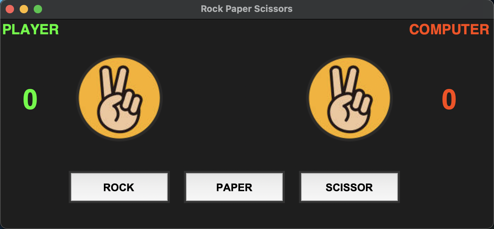
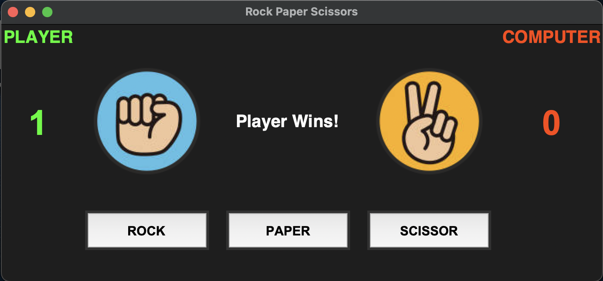
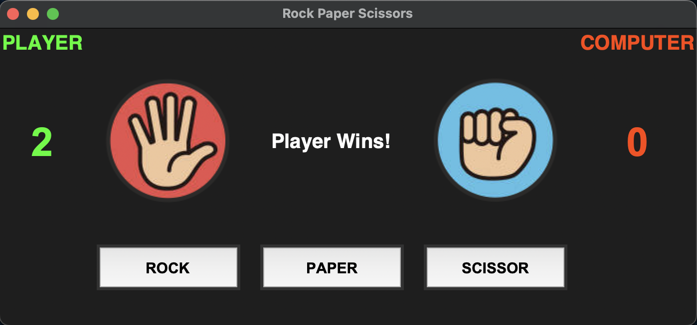
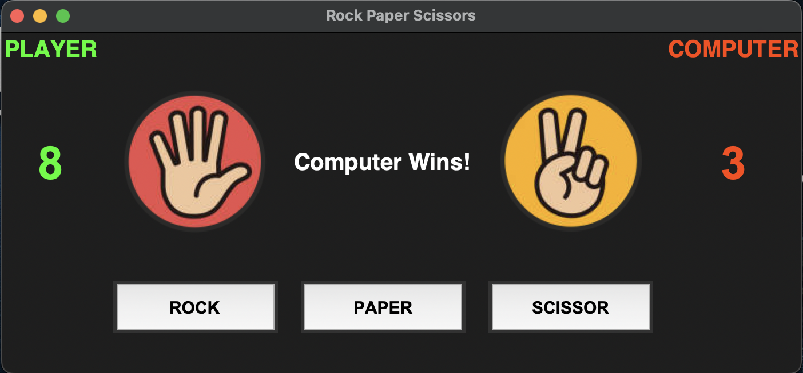
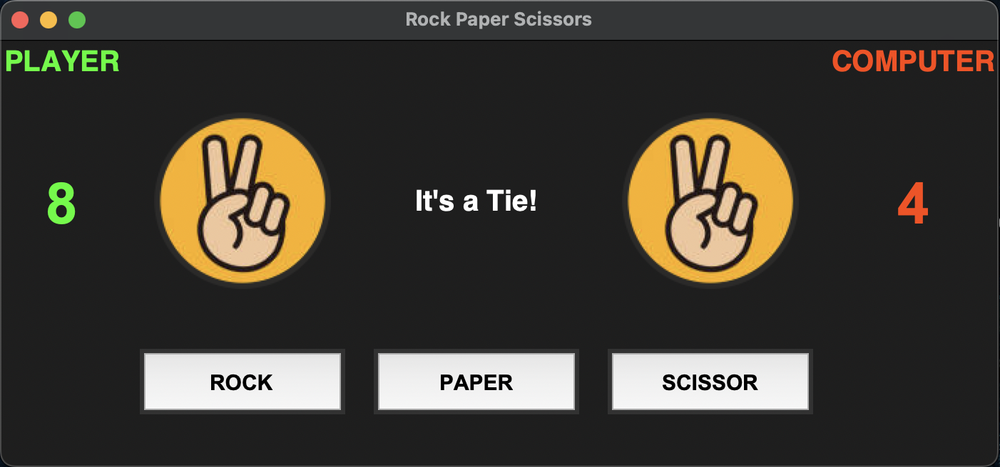

# Rock Paper Scissors Game 🎮✊✋✌️  

This is a simple **Rock, Paper, Scissors** game built using **Python** and **Tkinter** for the graphical user interface (GUI). The game allows a player to compete against the computer in this classic game of chance.  

## 📌 Features  
- User-friendly **GUI** made with Tkinter  
- Randomized computer moves using Python’s `random` module  
- Score tracking for both **player** and **computer**  
- Interactive buttons to select **Rock, Paper, or Scissors**  
- Displays winner after each round  

## 🖼️ Preview  
<p align="center">
  
  
  
</p>

<p align="center">
  
  
</p>

## 🛠️ Requirements  
Make sure you have the following installed before running the script:  
- Python 3.x  
- Tkinter (comes pre-installed with Python)  
- **Pillow** (for handling images)  

To install Pillow, run:  
```sh
pip install pillow
```

## 🚀 How to Run  
1. Clone the repository:  
   ```sh
   git clone https://github.com/jonahprashanth/Rock-Paper-Scissors.git
   ```
2. Navigate to the project folder:  
   ```sh
   cd Rock-Paper-Scissors
   ```
3. Run the Python script:  
   ```sh
   python game.py
   ```
   
## 🎮 How to Play  
1. Choose **Rock, Paper, or Scissors** by clicking the respective button.  
2. The computer will make a random selection.  
3. The winner is determined based on standard Rock-Paper-Scissors rules:  
   - **Rock beats Scissors**  
   - **Scissors beats Paper**  
   - **Paper beats Rock**  
4. The scores are updated accordingly.  

## 📷 Assets  
Ensure you have the following images in the same directory as the script:  
- `Rock.png`  
- `Paper.png`  
- `Scissor.png`  

## 💡 Future Improvements  
- Add sound effects for button clicks.  
- Implement a **reset** button.  
- Improve UI design with animations.  
- Keep track of **win/loss records** across multiple rounds.  

## 🤝 Contributing  
Feel free to submit a pull request if you’d like to improve the game!  

## 📜 License  
This project is open-source and available under the **MIT License**.  
